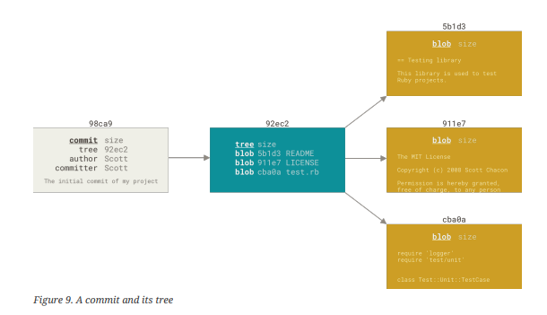

## Snapshots and not Changes 

Git doesn't store data as a series of changes , it stores data as series of snapshots.

When you make a commit, Git stores a commit object that contains a pointer to the snapshot of the content you staged. This object also contains the author’s name and email address, the message that you typed, and pointers to the commit or commits that directly came before this commit (its parent or parents): zero parents for the initial commit, one parent for a normal commit, and multiple parents for a commit that results from a merge of two or more branches.

#### Example:
Let's illustrate this with code for better understanding , follow the below steps
-  Make a empty directory 
-  Initialize git repo
-  Make  changes

```bash
mkdir MeraRepo
cd MeraRepo
git init 
touch index.js index.html styles.css
## Add the changes to staging areas 
git add . 
git commit -m "Web Project kr rha initalize"
```

##### What happens behind the scenes ? 



If you make some changes and commit again, the next commit stores a pointer to the commit that came immediately before it.


