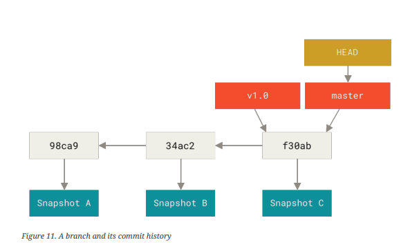
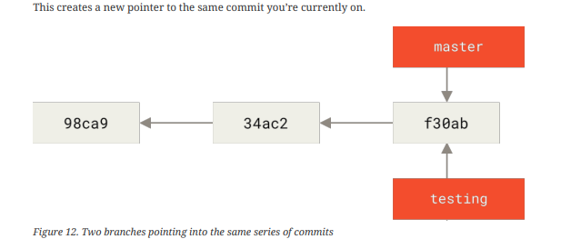

To really understand the way Git does branching, we must familarize ourselves with 
how [[How Git stores the data?]]


### Branch in Git

A branch in Git is simply a lightweight movable pointer to one of these commits. The default branch name in Git is master. As you start making commits, you’re given a master branch that points to the last commit you made. Every time you commit, the master branch pointer moves forward automatically.

> [!note]
>  The “master” branch in Git is not a special branch. It is exactly like any other
> branch. The only reason nearly every repository has one is that the git init
   ommand creates it by default and most people don’t bother to change it




---
### How to create a new branch?

When you create a new branch git makes a new pointer to the latest commit and hands it over to you

```bash
git branch testing
```

After above command git now has made a new pointer for us to to use and move around.





>[!faq]- How does Git know what branch you’re currently on?
>
>It keeps a special pointer called HEAD. Note that this is a lot different than the concept of HEAD in other VCSs you may be used to, such as Subversion or CVS. In Git, this is a pointer to the local branch you’re currently on. In this case, you’re still on master. The git branch command only created a new branch — it didn’t switch to that.
>![[head-pointer-diagram.png]]
>>[!tip] you can run
>>  ```bash
>>   git log --oneline --decorate
>>   ```
>>   

### How to switch to a new branch in git?

To simply switch to an existing branch in git you can simpy run :

```bash
git checkout <branch-name>
```

>[!note]- *Switching branches changes files in your working directory*
>
It’s important to note that when you switch branches in Git, files in your working
directory will change. If you switch to an older branch, your working directory
will be reverted to look like it did the last time you committed on that branch. If Git
cannot do it cleanly, it will not let you switch at all.

---

### What is a remote branch in git?

Remote references are references (pointers) in your remote repositories, including branches, tags, and so on. You can get a full list of remote references explicitly with git ls-remote , or git remote show for remote branches as well as more information. Nevertheless, a more common way is to take advantage of remote-tracking branches.

Remote-tracking branches are references to the state of remote branches. They’re local references that you can’t move; Git moves them for you whenever you do any network communication, to make sure they accurately represent the state of the remote repository. Think of them as bookmarks, to remind you where the branches in your remote repositories were the last time you connected to them

```bash
git remote add <remote-tracking-name> <remote-repo-url>
```

You cannot change the pointer of remote branches git does it for you.

Remote tracking branches takes the name of form :

> origin master 


